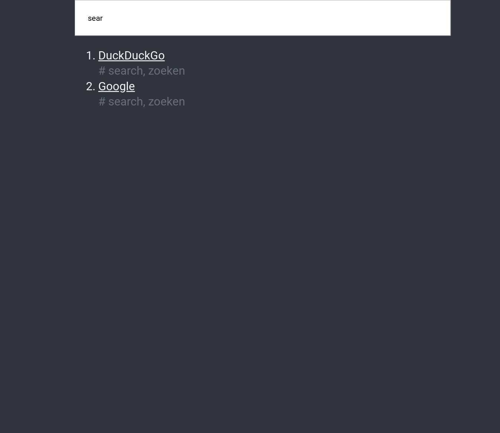
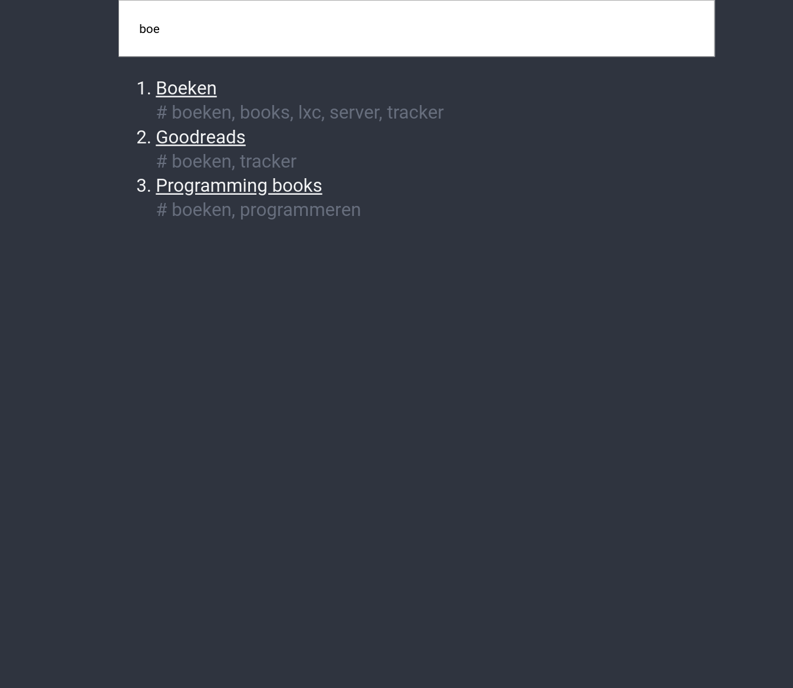

# bookmarks
custom web front for [buku][buku] (cli bookmark manager)

With the export.sh i export the bookmarks.html page to the webserver. This webpage makes it searchable.

[buku]: https://github.com/jarun/Buku
